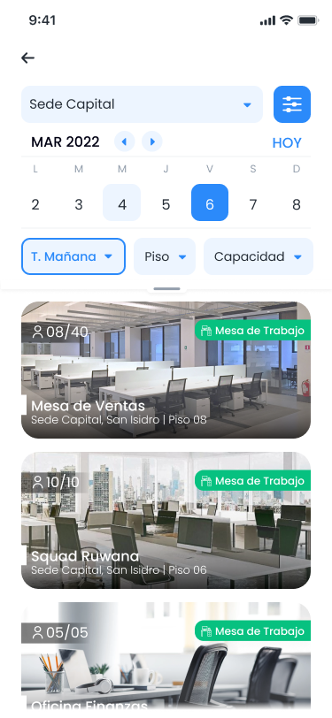
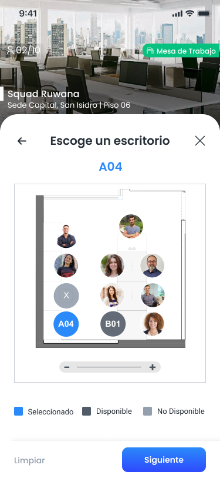
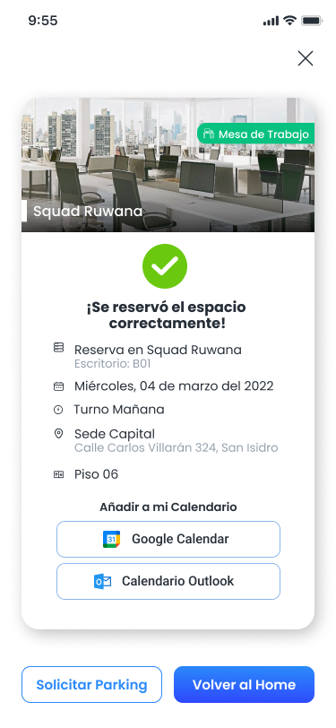
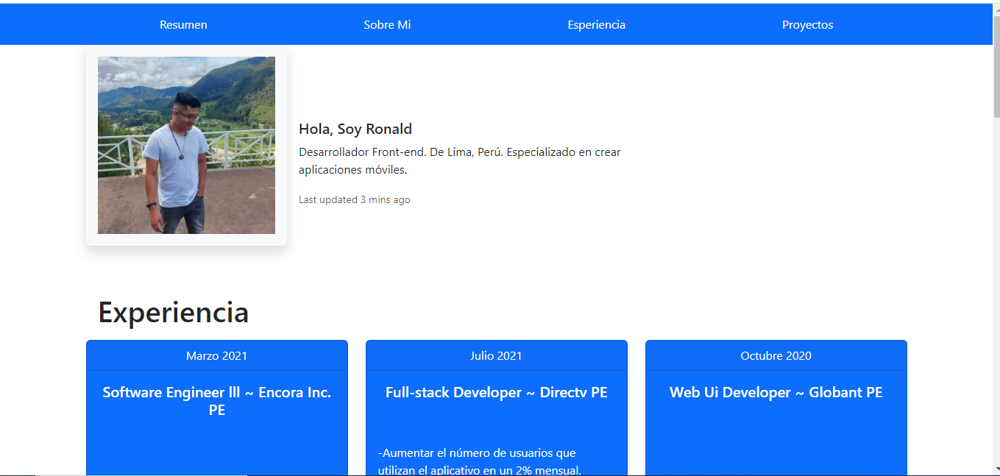
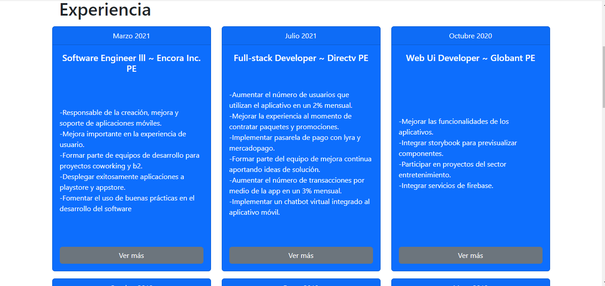

# Bootstrap

Este es una descripción de los componentes utilizados para hacer el diseño

## 1. Navbar

Se usó un menú de navegación responsive que cuando el tamaño es sm se convierte en un menú hamburguesa

```html
  <nav class="navbar navbar-expand-sm bg-primary d-flex justify-content-center">
    <div class="container-fluid">
      <button class="navbar-toggler" type="button" data-bs-toggle="collapse" data-bs-target="#navbarScroll" aria-controls="navbarScroll" aria-expanded="false" aria-label="Toggle navigation">
        <span class="navbar-toggler-icon"></span>
      </button>
      <div class="collapse navbar-collapse justify-content-sm-center" id="navbarScroll">
        <ul class="navbar-nav me-auto my-2 my-lg-0 navbar-nav-scroll" style="--bs-scroll-height: 100px;">
          <li class="nav-item">
            <a class="nav-link text-white" aria-current="page" href="#">Resumen</a>
          </li>
          <li class="nav-item">
            <a class="nav-link text-white" href="#">Sobre Mi</a>
          </li>
          <li class="nav-item">
            <a class="nav-link text-white" href="#">Esperiencia</a>
          </li>
          <li class="nav-item">
            <a class="nav-link text-white" href="#">Proyectos</a>
          </li>
        </ul>
      </div>
    </div>
  </nav>
```

```CSS
@media (min-width: 576px) {
    .navbar-nav {
      display: flex;
      justify-content: space-evenly;
      width: 100%;
    }
  }
```


## 2. Resume

Se usó un card en el cual englobaba un resumen sobre mí

```html
  <div class="card px-3 mt-3 mb-3 border border-0" style="max-width: 820px;" id="Resume">
    <div class="row g-0 align-items-center">
      <div class="col-sm-4">
        
      </div>
      <div class="col-sm-8 px-3">
        <div class="card-body">
          <h5 class="card-title">Hola, Soy Ronald</h5>
          <p class="card-text">Desarrollador Front-end. De Lima, Perú. Especializado en crear aplicaciones móviles.</p>
          <p class="card-text"><small class="text-body-secondary">Last updated 3 mins ago</small></p>
        </div>
      </div>
    </div>
  </div>
```

## 3. Experience

Se usó unasección que almacena cards de experiencia profesional

```html
  <section class="container" id="Experience">
    <h1 class="m-3">Experiencia</h1>
    <div class="row align-items-center">

    </div>
  </section>
```
## 4. Experience card

Se usó una sección de card que detalla la experiencia profesional

```html
        <div class="col-md-6 col-lg-4 mb-3 mb-sm-0">
          <div class="card text-center carExperience  text-bg-primary mb-3">
            <div class="card-header">Marzo 2021</div>
            <div class="card-body">
              <h5 class="card-title mb-3">Software Engineer lll ~ Encora Inc. PE</h5>
              <p class="card-text text-start">
                -Responsable de la creación, mejora y soporte de aplicaciones móviles.<br> 
                -Mejora importante en la experiencia de usuario.<br> 
                -Formar parte de equipos de desarrollo para proyectos coworking y b2.<br>
                -Desplegar exitosamente aplicaciones a playstore y appstore.<br>
                -Fomentar el uso de buenas prácticas en el desarrollo del software</p>
              <a href="https://www.linkedin.com/in/ronald-estela-quintana-985153162/" class="btn btn-secondary">Ver más</a>
            </div>
          </div>
        </div>
```

## 5. Carousel

Se usó un carousel para la transición de imágenes

```html
<div id="carouselExample" class="carousel slide carouselContainer">
                <div class="carousel-inner">
                  <div class="carousel-item active">
                    
                  </div>
                  <div class="carousel-item">
                    
                  </div>
                  <div class="carousel-item">
                    
                  </div>
                  <div class="carousel-item">
                    
                  </div>
                </div>
                <button class="carousel-control-prev" type="button" data-bs-target="#carouselExample" data-bs-slide="prev">
                  <span class="carousel-control-prev-icon" aria-hidden="true"></span>
                  <span class="visually-hidden">Previous</span>
                </button>
                <button class="carousel-control-next" type="button" data-bs-target="#carouselExample" data-bs-slide="next">
                  <span class="carousel-control-next-icon" aria-hidden="true"></span>
                  <span class="visually-hidden">Next</span>
                </button>
              </div>
```
aquí un pequeño ajemplo de cómo quedaría la página


